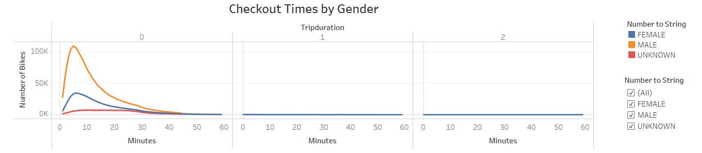
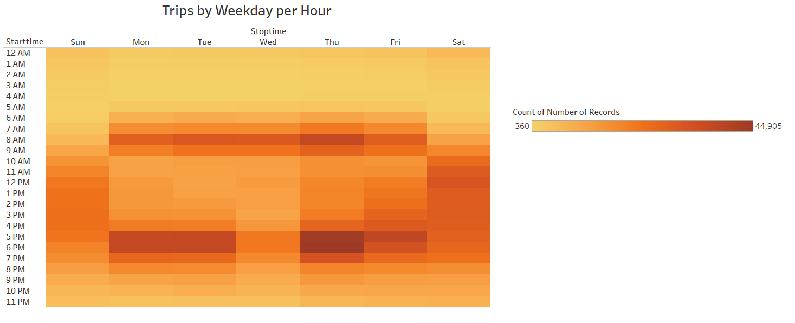

# Bikesharing

## Overview of the Analysis
The purpose of this analysis is to convince investors that a bike-sharing program in Des Moines, Iowa is a solid business proposal. Using data from a New York City bike-sharing program this analysis visualizes trip duration and peak times, gender, user type, and starting location data in order to persuade investors to create a similar program in Des Moines.

## Results: 

Visualizations below showcase results of this analysis. Full images with captions and additional information can be viewed via Tableau Story "NYC Bikesharing" [here](LINK GOES HERE)

Trips start in locations where larger, darker circles are seen above. The most dense section of trips is between Times Square and Washington Square Park, suggesting they may be popular locations for tourists to pick up a bike. 

Peak trip times in August are 5:00 to 6:00 PM. 8:00 AM is the next peak time, so it seems that more trips are still taken during rush hour in the summer months.

Males are more likely to take rides than females, as seen in the gender breakdown above.

Checkout times for the majority of the rides are short, running under 20 minutes. This would make sense if the bikes are being used to commute to and from work, or if tourists are using them to travel to a close location instead of walking.

Checkout times by gender are consistent with the gender breakdown for trips overall. Males are more likely to take rides than females, and the checkout times are similar for both females and males as well as for the unknown gender category.

Peak trip times are on weekends between 9:00 and 7:00 PM and during morning and evening rush hour during weekdays.

This image is consistent with the overall gender breakdown on trips, being that males are more likely to use the bikes than females. This breakdown also shows similar results to the image of "Trips by Weekday per Hour" in that trips are taken more often during rush hour on the weekdays and throughout the weekend days.

Customer trips are pretty consistent across gender and have small peaks on the weekend overall. Trips by subscribers show high traffic most days of the week and are still much more heavily taken by male riders.

## Summary
This analysis showcases the success of bikesharing in NYC with high numbers of trips and subscribers, specifically male subscribers, but further analysis should be done to determine if Des Moines would be an appropriate city for implementing bike sharing. Additional visualizations of data in Des Moines would be helpful in order to ensure this business proposal is viable. Perhaps examining geographical data or transportation data from Des Moines would allow for a more educated decision from investors before assuming Des Moines will fare similarly to New York City.  
    Additional Visualizations
         - Showing a comparison of starting station coordinates versus ending station coordinates in Des Moines may be useful for investors. Depending on the geographical layout of the city, this could help investors determine if additional effort would be needed to collect bikes from end stations and if riders would have access to enough bikes at their starting locations.
         - Examining a visualization with the age of riders and their starting or ending point could help investors implement additional features or safeguards for bikes and their riders.
         - Finally, showing a map of tourist locations and businesses for starting and ending location could help determine the types of drivers and whether they are using the bikes for tourism or work. This could help investors understand if Des Moines would see similar success based on their population. 